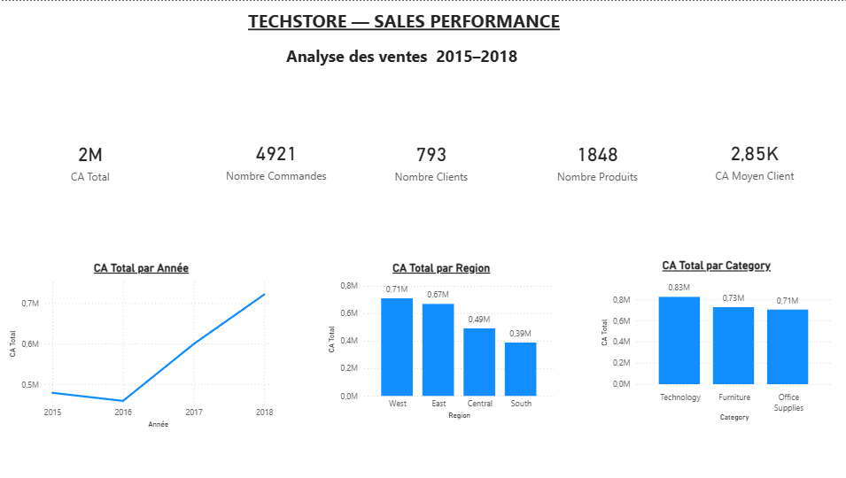
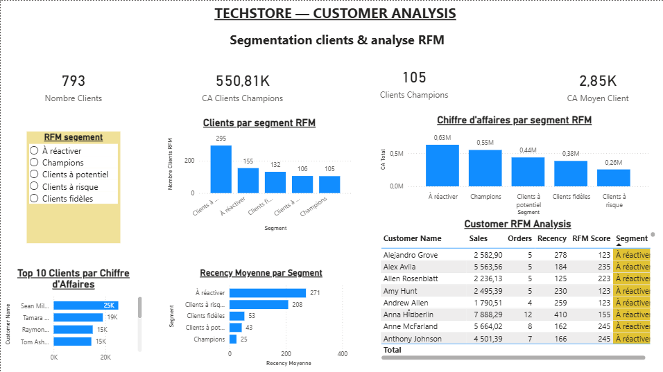
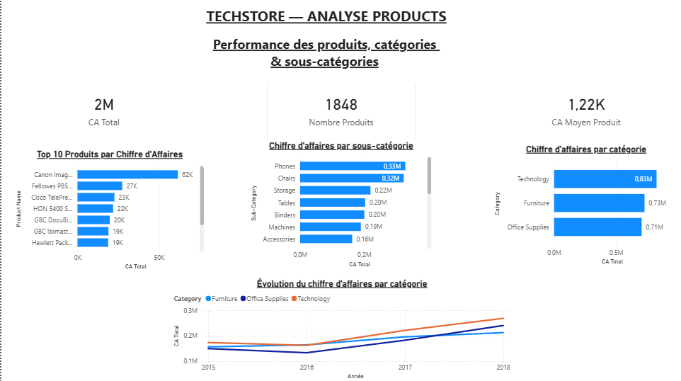

# 📊 TechStore Analysis — Sales, Customer & Product Analytics

Projet complet de **Data Analytics & Business Intelligence** réalisé avec **Python, SQL et Power BI** à partir d'un jeu de données de ventes de type Superstore.

L'objectif est de transformer des données transactionnelles en **indicateurs business**, d'analyser la performance commerciale, de comprendre le comportement des clients et d'identifier les produits et catégories les plus performants.

---

## 🎯 Objectifs

* Analyser l'évolution du chiffre d'affaires dans le temps
* Identifier les catégories et sous-catégories les plus performantes
* Identifier les produits générant le plus de chiffre d'affaires
* Comparer les performances commerciales par région
* Analyser la valeur et le comportement des clients
* Réaliser une segmentation client avec la méthode **RFM**
* Construire un dashboard interactif avec **Power BI**
* Utiliser **SQL** pour effectuer des analyses complémentaires

---

## 🛠️ Technologies utilisées

| Technologie    | Utilisation                                   |
| -------------- | --------------------------------------------- |
| 🐍 Python      | Nettoyage, préparation et analyse des données |
| 🐼 Pandas      | Manipulation et transformation des données    |
| 🗄️ SQL        | Requêtes et analyses analytiques              |
| 🧱 SQLite      | Stockage des données                          |
| 🔄 Power Query | Transformation des données dans Power BI      |
| 📐 DAX         | Création des KPI et mesures                   |
| 📊 Power BI    | Data visualization et dashboard interactif    |
| 📗 Excel       | Source initiale des données                   |

---

## 📊 Dataset

Le dataset contient **9 794 transactions** après nettoyage.

Les principales informations disponibles sont :

* commandes
* clients
* dates de commande
* produits
* catégories
* sous-catégories
* régions
* modes de livraison
* chiffre d'affaires

Les données sources Excel ne sont pas versionnées sur GitHub afin de conserver un repository léger et propre.

---

# 📈 Résultats clés

## 💰 Performance commerciale

| KPI                      |    Résultat |
| ------------------------ | ----------: |
| Chiffre d'affaires total | **2,26 M$** |
| CA 2015                  |   479,33 K$ |
| CA 2016                  |   459,44 K$ |
| CA 2017                  |   599,49 K$ |
| CA 2018                  |   721,35 K$ |

### Évolution annuelle

* **2016 : -4,15 %**
* **2017 : +30,48 %**
* **2018 : +20,33 %**

La performance commerciale connaît une forte accélération à partir de 2017.

---

## 🏆 Performance par catégorie

| Catégorie       | Chiffre d'affaires |
| --------------- | -----------------: |
| Technology      |      **825,53 K$** |
| Furniture       |      **728,66 K$** |
| Office Supplies |      **705,42 K$** |

**Technology** est la catégorie générant le plus de chiffre d'affaires.

---

## 🌎 Performance régionale

| Région  | Chiffre d'affaires |
| ------- | -----------------: |
| West    |      **710,22 K$** |
| East    |      **669,40 K$** |
| Central |      **491,54 K$** |
| South   |      **388,45 K$** |

La région **West** est la plus performante en termes de chiffre d'affaires.

---

# 👥 Analyse clients — Segmentation RFM

Une segmentation **RFM (Recency, Frequency, Monetary)** a été développée afin d'évaluer la valeur et le comportement des clients.

### Les trois dimensions

**Recency**
Nombre de jours depuis le dernier achat.

**Frequency**
Nombre de commandes réalisées.

**Monetary**
Chiffre d'affaires généré par le client.

### Segments identifiés

* 🏆 **Champions**
* ⭐ **Clients fidèles**
* 📈 **Clients à potentiel**
* 🔄 **À réactiver**
* ⚠️ **Clients à risque**

Cette segmentation permet d'identifier :

* les clients à forte valeur ;
* les clients fidèles à conserver ;
* les clients présentant un potentiel de développement ;
* les clients inactifs pouvant être réactivés ;
* les clients présentant un risque de perte.

---

## 📦 Analyse produits

L'analyse produits permet d'identifier :

* les produits générant le plus de chiffre d'affaires ;
* les catégories les plus performantes ;
* les sous-catégories les plus performantes ;
* l'évolution du chiffre d'affaires par catégorie ;
* les produits représentant les meilleures opportunités commerciales.

---

# 💡 Business Insights

L'analyse permet de dégager plusieurs enseignements :

### 1. Une forte accélération des ventes

Après une baisse du chiffre d'affaires en 2016, l'activité progresse fortement en 2017 puis en 2018.

### 2. Technology est la catégorie leader

La catégorie Technology génère le chiffre d'affaires le plus important et constitue donc un axe stratégique important.

### 3. Les performances régionales sont hétérogènes

Le chiffre d'affaires est particulièrement concentré dans les régions West et East, tandis que South présente une performance plus faible.

### 4. La segmentation RFM permet de cibler les actions commerciales

Les différents segments clients permettent d'adapter les actions marketing :

* fidélisation des Champions ;
* développement des clients à potentiel ;
* réactivation des clients inactifs ;
* prévention du churn pour les clients à risque.

---

# 📊 Dashboard Power BI

Le dashboard est organisé en **3 pages complémentaires**.

## 1️⃣ Analyse des ventes

Vue globale de la performance commerciale :

* CA total
* évolution annuelle du CA
* CA par catégorie
* CA par région
* principaux indicateurs commerciaux



---

## 2️⃣ Analyse clients

Analyse du comportement et de la valeur des clients :

* segmentation RFM
* nombre de clients par segment
* CA par segment
* Top 10 clients
* récence moyenne
* détail des scores RFM



---

## 3️⃣ Analyse produits

Analyse de la performance des produits :

* CA par catégorie
* CA par sous-catégorie
* Top 10 produits
* évolution du CA par catégorie
* nombre de produits
* CA moyen par produit



---

# 🧮 Principaux KPI Power BI

Quelques mesures DAX développées dans le projet :

```DAX
CA Total =
SUM(sales[Sales])
```

```DAX
Nombre Commandes =
DISTINCTCOUNT(sales[Order ID])
```

```DAX
Nombre Clients =
DISTINCTCOUNT(sales[Customer ID])
```

```DAX
Panier Moyen =
DIVIDE([CA Total], [Nombre Commandes])
```

```DAX
CA Moyen Client =
DIVIDE([CA Total], [Nombre Clients])
```

Ces mesures sont utilisées dans les différentes pages du dashboard Power BI.

---

# 🗄️ Analyse SQL

Une base **SQLite** a été créée à partir des données nettoyées.

Le projet contient plusieurs scripts permettant de :

* créer la base de données ;
* charger les données ;
* effectuer des requêtes analytiques ;
* analyser les ventes ;
* analyser les clients ;
* analyser les produits.

Les scripts SQL sont disponibles dans le dossier :

```text
notebook/
```

---

# 🐍 Analyse Python

Python est utilisé pour :

1. charger les données ;
2. vérifier la qualité des données ;
3. nettoyer les données ;
4. effectuer les analyses statistiques ;
5. préparer les données pour SQL et Power BI ;
6. produire les fichiers CSV utilisés dans le dashboard.

---

# 📁 Structure du projet

```text
TechStore_Analysis/
│
├── data/
│   ├── sales.csv
│   └── customer_rfm.csv
│
├── database/
│   └── techstore.db
│
├── notebook/
│   ├── analyse.py
│   ├── create_database.py
│   └── sql_analysis.py
│
├── screenshots/
│   ├── page1-analyse-ventes.png
│   ├── page2-analyse-clients.png
│   └── page3-analyse-produits.png
│
├── .gitignore
└── README.md
```

> Le fichier Power BI `.pbix` et le fichier Excel source ne sont pas versionnés dans le repository. Le rapport Power BI peut être partagé séparément via Power BI Service.

---

# 🔄 Méthodologie

```text
Données brutes
      ↓
Nettoyage avec Python / Pandas
      ↓
Préparation des données
      ↓
Stockage SQLite
      ↓
Analyses SQL
      ↓
Préparation des données RFM
      ↓
Power Query
      ↓
Modélisation Power BI
      ↓
Mesures DAX
      ↓
Dashboard interactif
      ↓
Business Insights
```

---

# 🚀 Compétences démontrées

Ce projet met en pratique plusieurs compétences recherchées pour un poste de **Data Analyst / BI Analyst** :

* Data Cleaning
* Data Preparation
* Exploratory Data Analysis
* Python
* Pandas
* SQL
* SQLite
* Power Query
* DAX
* Power BI
* Data Visualization
* KPI Development
* Customer Segmentation
* RFM Analysis
* Business Analysis
* Data Storytelling

---

# 👤 Auteur

**Ramzi Ayachi**

L3 Informatique — Université Toulouse Jean Jaurès

**Recherche : Stage / Alternance — Data Analyst / Data / Business Intelligence**

📌 Toulouse / France

---

## 🔗 Projet

**GitHub :**
https://github.com/ramzi-ayachi1931/TechStore_Analysis


---

⭐ Si ce projet vous intéresse, n'hésitez pas à consulter le repository et les différentes analyses.
